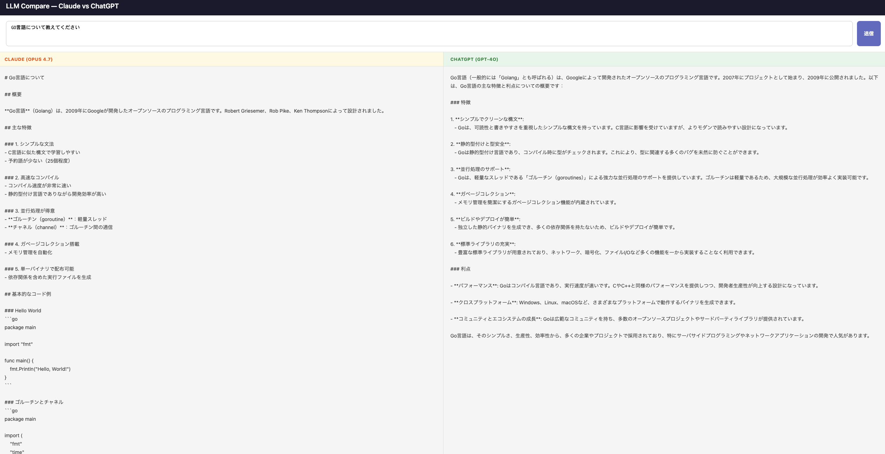

# Claude Codeを触ってみたら、アプリが1時間で完成した話

## Claude Codeって何？

AnthropicがリリースしたAI開発ツールです。チャット形式でやり取りしながら、コードの生成・修正・ファイル操作まで行ってくれます。

今回はCursorの拡張機能として使いました。最近社内でも話題に上がっていたので、実際に触ってみました。

## 作ったもの

「ClaudeとChatGPTの回答を左右に並べて比較できるWebアプリ」を題材にしました。

## 実際に触ってみて

やり取りはシンプルで、「こういうものを作りたい」と伝えるだけです。バックエンドもフロントエンドも、ほぼ自分でコードを書かずに完成しました。詰まった箇所も都度聞けば解決してくれました。

**所要時間はおよそ1時間。**

「作れそう」と思ってから動くものが完成するまでこの速さは、素直に驚きました。

## 一番印象に残ったこと

Cursorの拡張機能として動くため、**今までのチャット感覚でプロンプトを投げるだけで、手元の環境に直接反映される**点が新鮮でした。ファイルの作成・編集・コマンド実行まで、普段使っているエディタ上で完結します。

「新しいツールを覚えなきゃ」という感覚がなく、ハードルの低さが良かったです。

## おわりに

Claude Codeに限らず、AIツールはまだ自分の中で使い分けができていません。ただ、触ってみて初めてわかることも多いと感じました。気になっている方はまず動かしてみることをおすすめします。

## リポジトリ

https://github.com/Toshimitsu-M/ll-compare
